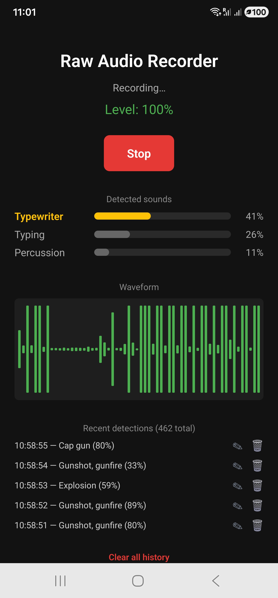
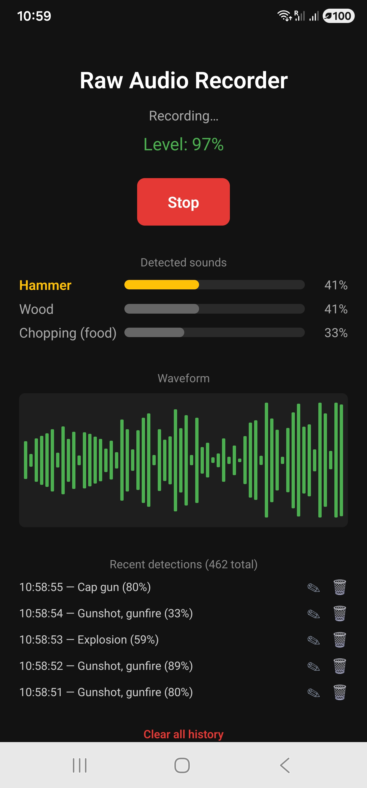
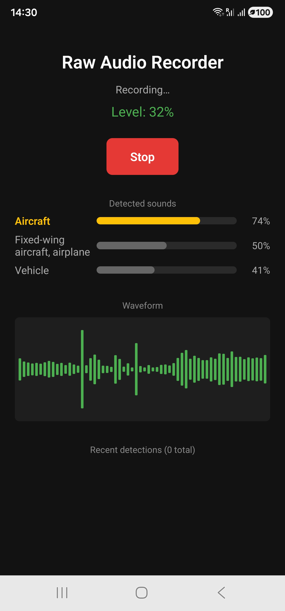
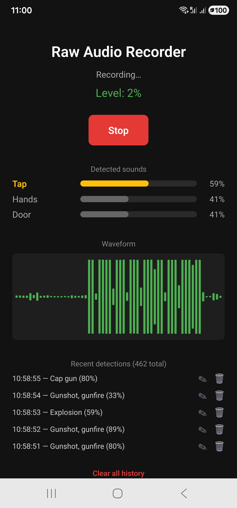

# AudioClassifier

A React Native app that captures **raw PCM audio** through a **custom Java native module**, classifies sounds in real time with an on-device **TensorFlow Lite** model (YAMNet), and gives full **CRUD** control over a persistent **SQLite** event log — correct a mislabeled detection, delete a single entry, or clear the history. Recordings export as playable WAV files.

Audio never touches the JavaScript thread. Capture, resampling, and inference all run in Java on dedicated threads; only lightweight results cross the bridge to the UI.

A companion notebook in [`ml/`](ml/) documents a separate, offline pipeline that fine-tunes YAMNet on a custom dataset — see [Model training](#model-training) below.

---

## Why a native module?

React Native alone cannot handle continuous audio buffering. `AudioRecord.read()` blocks until a buffer fills, and dropped samples mean corrupted audio — so the capture loop lives entirely in Java on its own thread.

```
┌──────────────────────┐         ┌──────────────────────────────────────┐
│  JavaScript (React)  │         │        Java Native Modules           │
│                      │         │                                      │
│  initialize() ───────┼────────▶│  AudioRecord setup + TFLite load     │
│  start()      ───────┼────────▶│  Capture thread starts               │
│  stop()       ───────┼────────▶│  Thread joins, WAV written           │
│                      │         │                                      │
│  onAmplitude    ◀────┼─────────┤  Peak level, ~20×/sec                │
│  onClassification ◀──┼─────────┤  Top 3 labels + scores, ~1×/sec      │
│         │            │         └──────────────────────────────────────┘
│         ▼            │
│   SQLite (events)    │
└──────────────────────┘
```

---

## Features

- **Raw microphone capture** via `android.media.AudioRecord` — 44,100 Hz, mono, 16-bit PCM
- **On-device sound classification** with YAMNet, covering 521 AudioSet event categories
- **Top-3 predictions** with confidence bars, exposing the model's runners-up rather than a single guess
- **Full CRUD event log** — every confident detection is auto-logged (Create), the last 5 shown live with a running total (Read), any entry's label can be corrected in place (Update), and entries can be removed individually or all at once (Delete)
- **Real-time resampling** from 44.1 kHz capture to the 16 kHz the model requires
- **Non-blocking inference** — classification runs on a separate thread so it never stalls the audio read
- **WAV export** — headerless PCM wrapped with a hand-built 44-byte RIFF header
- **Live waveform and level meter** driven by amplitude events from Java

---

## Screenshots

| Idle | Recording | Classifying + event log |
|---|---|---|
|  |  |  |

### Recognizing a wide range of sounds

YAMNet's 521-category taxonomy means the same pipeline distinguishes between acoustically very different kinds of sound — everyday object interactions, tools, transport, office equipment, and sharp impact sounds — without any per-category tuning:

| Household / touch | Tools & woodwork |
|---|---|
|  |  |
| Tap · Hands · Door | Hammer · Wood · Chopping (food) |

| Transport | Sharp / percussive impacts |
|---|---|
|  |  |
| Aircraft · Fixed-wing aircraft, airplane · Vehicle | Cap gun · Gunshot, gunfire · Explosion |

That last category is a good illustration of the model's fine-grained taxonomy rather than a misclassification: AudioSet's ontology groups sharp, high-transient, impulsive sounds together, so a crisp tap or clap can land in the same acoustic neighborhood as a cap gun or firework — genuinely similar waveforms, very different real-world sources. It's a useful, honest example of where a general-purpose 521-class model's granularity helps (clear separation from, say, wind or speech) and where it can surprise you (fine distinctions within "sharp transient" are hard).

---

## Tech stack

| Layer | Technology |
|---|---|
| UI | React Native 0.86, TypeScript |
| Bridge | `ReactContextBaseJavaModule`, `@ReactMethod`, `DeviceEventEmitter` |
| Audio | Java, `android.media.AudioRecord` |
| ML (on-device) | TensorFlow Lite Task Audio 0.4.4, YAMNet |
| ML (training) | Python, TensorFlow, TensorFlow Hub — see [`ml/`](ml/) |
| Storage | SQLite via `react-native-nitro-sqlite`, full CRUD |
| Build | Gradle, Android SDK, JDK 17 |

---

## Project structure

| Path | Responsibility |
|---|---|
| `App.tsx` | React UI, permissions, native calls, waveform, predictions, and the CRUD event-log UI (edit modal, delete, clear-all) |
| `db.ts` | SQLite schema and all CRUD operations: `logEvent` (create), `getRecentEvents`/`getEventCount` (read), `updateEventLabel` (update), `deleteEvent`/`clearEvents` (delete) |
| `android/.../AudioCaptureModule.java` | Capture engine, buffer loop, resampling, WAV writer |
| `android/.../AudioClassifierModule.java` | TFLite model loading, inference, top-N ranking |
| `android/.../AudioCapturePackage.java` | Registers both modules and wires them together |
| `android/app/src/main/assets/yamnet.tflite` | The on-device classification model (stock YAMNet) |
| `ml/yamnet_esc50_finetuning.ipynb` | Offline training notebook — see below |

---

## The pipeline

1. **Permission** — JS requests `RECORD_AUDIO` via `PermissionsAndroid` before any native call.
2. **Initialization** — `getMinBufferSize()` returns the framework minimum; the buffer is oversized 4× for headroom. The TFLite model loads from assets and reports its required sample rate (16 kHz). SQLite opens, creates the events table if absent, and the persisted history loads immediately so past detections are visible on launch, not just after a new recording.
3. **Capture** — a background thread loops on `audioRecord.read()`, writing each buffer straight to a temporary `.pcm` file.
4. **Amplitude** — each buffer is scanned for peak level by combining little-endian byte pairs into 16-bit samples.
5. **Resampling** — samples are decimated from 44,100 Hz to 16,000 Hz using a fractional counter, normalized to −1…1, and accumulated into YAMNet's 15,600-sample window (≈0.975 s).
6. **Inference** — when a full window is ready it is cloned and handed to a worker thread, so the capture loop never waits on the model. Categories are sorted by score and the top three are emitted to JS as an array.
7. **Logging** — detections scoring 0.3 or higher are inserted into SQLite with an ISO timestamp, using parameterized queries.
8. **Correction** — tapping any logged entry opens an edit modal to correct its label in place; a delete icon removes a single entry, and a "Clear all history" action (with confirmation) empties the table.
9. **Export** — on stop, a `volatile` flag ends the loop, the thread is joined, and the PCM is converted to a standard WAV file.

---

## Model training

<a id="model-training"></a>

The app ships with Google's stock YAMNet, chosen because it runs with the high-level TFLite Task Audio library and needs no extra native dependencies. A separate offline pipeline — [`ml/yamnet_esc50_finetuning.ipynb`](ml/yamnet_esc50_finetuning.ipynb) — explores fine-tuning YAMNet on a custom dataset, kept intentionally apart from the production app.

**Dataset:** [ESC-50](https://github.com/karolpiczak/ESC-50) — 2,000 five-second environmental sound clips across 50 classes, split by the dataset's predefined folds to avoid source-recording leakage between train and test.

**Approach:** YAMNet used as a frozen feature extractor (transfer learning), with a dense classifier head trained on its 1024-dimensional embeddings. Training from scratch was not attempted — with 2,000 clips it would overfit badly.

**Result: 88.0% clip-level test accuracy** (73.1% frame-level; random baseline 2%) on a held-out fold.

| Iteration | Frame-level | Clip-level |
|---|---|---|
| Baseline (frozen YAMNet, no augmentation) | 63.4% | 85.3% |
| + extended training (early-stopping patience) | 64.1% | 86.5% |
| + additional training data (80/20 split) | 64.2% | 87.5% |
| + batch normalization, label smoothing | 65.2% | 87.5% |
| + temporal-context windowing (3-frame input) | **73.1%** | **88.0%** |

Techniques applied along the way: waveform-level data augmentation (time shift, additive noise, gain, time-stretch) applied only to training data; batch normalization and label smoothing in the classifier head; and temporal-context windowing, which concatenates three consecutive YAMNet embeddings so the model can disambiguate a frame using its neighbours rather than judging it in isolation — the single largest improvement, since many individual frames of environmental audio are ambiguous out of context.

**Why this model is not deployed in the app.** The combined YAMNet + classifier graph relies on TensorFlow ops with no TFLite-builtin equivalent, so loading it requires the Flex delegate (`SELECT_TF_OPS`), which adds 20–40 MB to the APK and would require dropping from the Task Audio library to the lower-level `Interpreter` API. Given the production app is scoped to on-device inference with the AudioRecord pipeline, and the custom-trained model exists to demonstrate the training methodology itself, the two are kept separate rather than coupled.

*See also: [ModelBench](https://github.com/SelenaG4/ModelBench), a companion app built specifically to compare quantized model variants live, on-device — including a documented investigation into a hard-to-classify confusable class (`glass_breaking`) across three different mitigation attempts.*

---

## Key concepts demonstrated

- **React Native native modules** — exposing Java to JavaScript with `@ReactMethod` and Promises
- **Bridging real-time data** — high-frequency events and structured arrays to JS without blocking either thread
- **On-device ML** — loading a TFLite model from assets and running inference off the audio thread
- **Sample-rate conversion** — decimation between capture and model rates
- **Full local persistence (CRUD)** — schema creation, parameterized inserts, reads with aggregate counts, in-place updates, and both single-row and bulk deletes
- **Digital audio fundamentals** — sample rate, bit depth, channel config, PCM encoding
- **The WAV container format** — building the RIFF/`fmt `/`data` header by hand
- **Java concurrency** — `volatile` flags, `Thread.join()`, worker threads for inference
- **Transfer learning and model evaluation** — frozen-feature extraction, fold-based splitting, frame- vs. clip-level metrics, and a documented iterative improvement process (see `ml/`)

---

## Build & run

```bash
npm install
npx react-native run-android
```

Requires Node 22+, JDK 17, the Android SDK, and a **physical device** (emulator microphones are unreliable).

Recordings can be retrieved with:

```bash
adb pull /sdcard/Android/data/com.audioclassifier/files/ .
```

The training notebook is self-contained and runs on Google Colab — no local Python setup needed. Open `ml/yamnet_esc50_finetuning.ipynb` there and run all cells.

---

## Notes and limitations

- **SQLite library choice.** `react-native-sqlite-storage` is the long-standing default, but it still declares the retired `jcenter()` repository and fails outright under Gradle 9. `react-native-nitro-sqlite` was used instead: it targets the New Architecture and builds cleanly on the current toolchain.
- **Classifier accuracy (on-device).** Stock YAMNet is a general-purpose AudioSet model. Sustained sounds such as speech, clapping, and engine noise classify confidently; short or ambiguous transients often produce low-confidence labels or land in an acoustically-similar-but-semantically-different category (see the impact-sounds example above). Showing the top three makes this uncertainty visible rather than hiding it behind one guess.
- **Thread separation.** File writing currently happens on the capture thread. A production design would hand buffers to a dedicated writer thread so disk I/O can never delay the audio read.
- **Logging granularity.** Only the single highest-scoring label is written to the database, even though three are shown live. Storing all three would allow richer analysis of the event log.
- **Fine-tuned model accuracy.** 88% clip-level on full 50-class ESC-50 is within the range of published YAMNet-transfer results, but full end-to-end fine-tuning or model ensembling would likely push it higher at the cost of significantly more training time and, for an ensemble, multiple models to maintain.

---

## Roadmap

- **FFT spectrum analyzer** for frequency-domain visualization
- **Foreground service** so capture and classification survive backgrounding
- **Filtering and export** of the event log
- **Knowledge distillation** of the fine-tuned model into a single deployable network, as a path to using the custom model on-device without the Flex delegate overhead

---

## License

MIT
