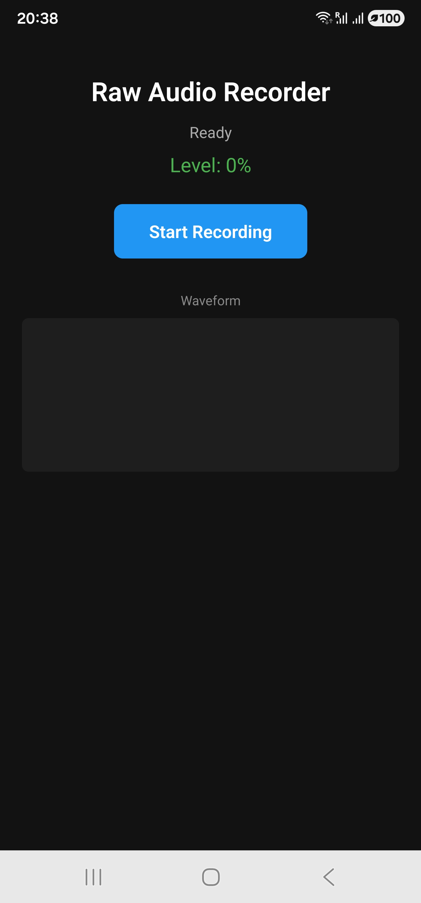
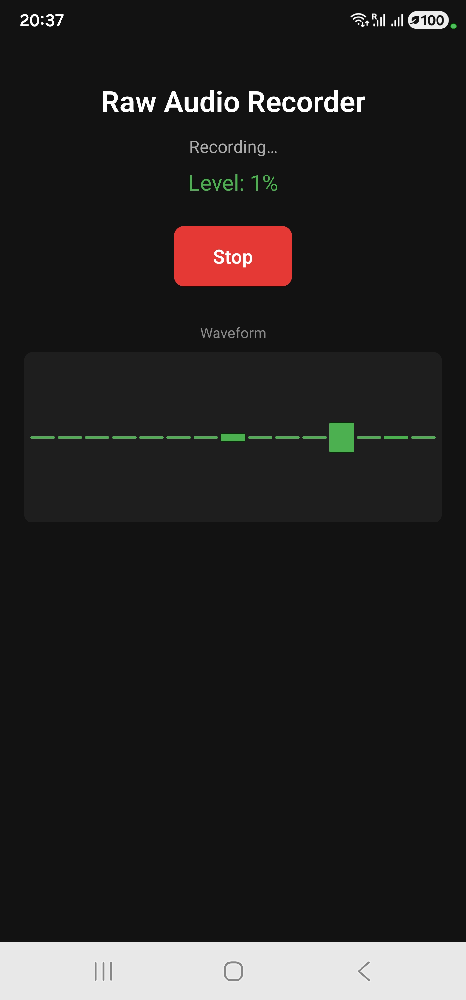
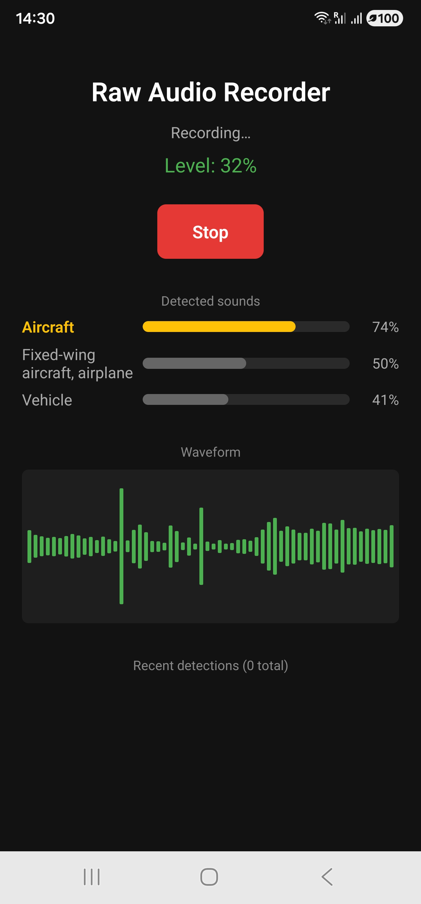

# AudioClassifier

A React Native app that captures **raw PCM audio** through a **custom Java native module** wrapping Android's low-level `android.media.AudioRecord` API. Audio is buffered on a dedicated background thread, exported as playable WAV files, and streamed back to the JavaScript layer in real time to drive a live level meter and waveform.

React Native alone cannot handle continuous audio buffering — this project demonstrates the native-module bridge that makes it possible.

---

## Why a native module?

React Native's JavaScript thread is not suited to real-time audio: `AudioRecord.read()` blocks until a buffer fills, and dropped samples mean corrupted audio. The capture loop therefore lives entirely in Java on its own thread, and only lightweight amplitude values cross the bridge to the UI.

```
┌──────────────────────┐         ┌────────────────────────────────┐
│  JavaScript (React)  │         │      Java Native Module        │
│                      │         │                                │
│  initialize() ───────┼────────▶│  AudioRecord setup             │
│  start()      ───────┼────────▶│  Capture thread starts         │
│  stop()       ───────┼────────▶│  Thread joins, WAV written     │
│                      │         │                                │
│  onAmplitude  ◀──────┼─────────┤  DeviceEventEmitter (20+/sec)  │
└──────────────────────┘         └────────────────────────────────┘
        Promises                          @ReactMethod
```

---

## Features

- **Raw microphone capture** via `android.media.AudioRecord` — 44,100 Hz, mono, 16-bit PCM
- **Manual buffer management** on a dedicated background thread so the blocking read never stalls the UI
- **WAV export** — headerless PCM is written to disk, then wrapped with a hand-built 44-byte RIFF header
- **Live amplitude streaming** from Java to JavaScript via `DeviceEventEmitter`
- **Real-time waveform and level meter** rendered in React
- **Promise-based API** so JS can `await` native calls and handle errors idiomatically

---

## Screenshots

| Idle | Recording | Saved |
|---|---|---|
|  |  |  |

---

## Tech stack

| Layer | Technology |
|---|---|
| UI | React Native 0.86, TypeScript |
| Bridge | `ReactContextBaseJavaModule`, `@ReactMethod`, `DeviceEventEmitter` |
| Audio | Java, `android.media.AudioRecord` |
| Build | Gradle, Android SDK, JDK 17 |

---

## Project structure

| File | Responsibility |
|---|---|
| `App.tsx` | React UI, permission request, native module calls, waveform rendering |
| `android/.../AudioCaptureModule.java` | Capture engine, buffer loop, WAV writer, event emitter |
| `android/.../AudioCapturePackage.java` | Registers the module with React Native |
| `android/.../MainApplication.kt` | Adds the package to the app's package list |
| `android/app/src/main/AndroidManifest.xml` | Declares `RECORD_AUDIO` |

---

## How the audio pipeline works

1. **Permission** — JS requests `RECORD_AUDIO` through `PermissionsAndroid` before any native call.
2. **Initialization** — `getMinBufferSize()` returns the framework minimum for the chosen sample rate, channel config, and encoding; the buffer is oversized 4× for headroom.
3. **Capture** — a background `Thread` loops on `audioRecord.read()`, writing each byte buffer straight to a temporary `.pcm` file.
4. **Analysis** — each buffer is scanned for peak amplitude by combining little-endian byte pairs into 16-bit samples; the normalized value is emitted to JS.
5. **Export** — on stop, a `volatile` flag ends the loop, the thread is joined, and the raw PCM is converted to a standard WAV file with a generated header.

---

## Key concepts demonstrated

- **React Native native modules** — exposing Java to JavaScript with `@ReactMethod` and Promises
- **Bridging real-time data** — pushing high-frequency events to JS without blocking either thread
- **Digital audio fundamentals** — sample rate, bit depth, channel configuration, PCM encoding
- **Low-level buffer handling** — sizing from `getMinBufferSize()`, avoiding dropped samples
- **The WAV container format** — constructing the RIFF/`fmt `/`data` header by hand
- **Java concurrency on Android** — `volatile` stop flag, clean `Thread.join()` teardown

---

## Build & run

```bash
npm install
npx react-native run-android
```

Requires Node 22+, JDK 17, the Android SDK, and a **physical device** (emulator microphones are unreliable).

Recordings are saved to the app's external files directory and can be retrieved with:

```bash
adb pull /sdcard/Android/data/com.audioclassifier/files/ .
```

---

## Roadmap

- **TensorFlow Lite** on-device audio classification (YAMNet) fed from the existing capture buffers
- **FFT spectrum analyzer** for frequency-domain visualization
- **Foreground service** so capture survives backgrounding
- **SQLite** logging of classification events
- Move file writing to a separate producer/consumer thread so disk I/O can never delay the audio read

---

## License

MIT
